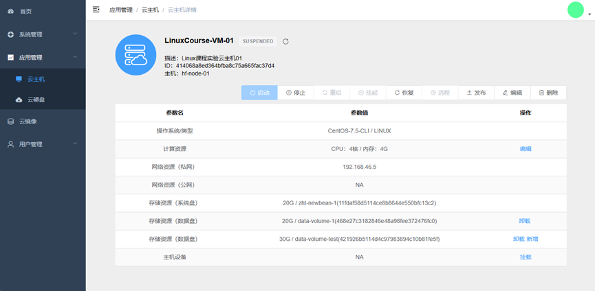

# KubeIaaS-基于Kubernetes的私有IaaS云解决方案

> [Change to English](./docs/README-EN.md)

本项目由 [“自邮之翼”](http://www.free4inno.com) 团队研发。

## ⭐ 产品介绍

KubeIaaS 是基于 Kubernetes 的易于部署和运维、功能完备且易用的私有 IaaS 云解决方案，
旨在充分利用 Kubernetes 的强大能力，将其应用场景从容器云领域拓展到 IaaS 云领域，从而进一步提高基于 Kubernetes 的 IT 基础架构的灵活性和可扩展性。 

**为什么选择 KubeIaaS ？**

- 相比原生 Kubernetes，引入了 KubeIaaS 的 Kubernetes 可以同时提供容器云和 IaaS 云能力，可支撑的 IT 基础架构的灵活性和可扩展性大大提升；

- 相比其他 IaaS 云平台（如 OpenStack、CloudStack 等），KubeIaaS 利用 Kubernetes 部署和管理 KubeIaaS 的各个组件，使其部署和运维更为轻量便捷；

- 相比其他 Kubernetes 虚拟机资源扩展组件（如 Kubevirt、Virtlet 等），KubeIaaS 提供了更为全面的云主机、云硬盘以及云镜像等 IaaS 云管控能力和更为友好易用的 Web 管理界面。

[观看产品介绍及演示视频](https://www.bilibili.com/video/BV1em4y1C7uE/)

## 💡 关键特征

- **部署便捷**

KubeIaaS 通过在 Kubernetes 中利用 YAML 资源清单统一编排容器化组件，简化了繁琐的部署流程，避免了大量的重复操作。为适应 “裸机集群” 和 “已存在的Kubernetes集群” 等不同场景，KubeIaaS 提供了详细的部署指南。

- **维护简单**

KubeIaaS 利用 Kubernetes 的资源调度能力和 Prometheus、Loki 等云原生运维套件，充分降低了系统的运维成本。用户可以轻松获取系统组件的运行情况，监控宿主机和云主机的运行状态，以及掌握系统资源的使用状况。

- **功能完备**

作为一套完备的私有 IaaS 云解决方案，KubeIaaS 通过直观且易于操作的 Web 管理界面，使用户能够轻松地创建、配置和管理云主机、云硬盘和云镜像等各类云资源，从而显著提升云基础设施的使用效率和管理便捷性。

- **资源丰富**

用户可以通过 KubeIaaS 官方提供的或是自行搭建的云镜像中心轻松下载和管理集群内云主机所需的镜像。

## 🚀 安装部署

- 在裸机上进行部署 [链接](./docs/deploy/deploy-os-ubuntu-22.04-cn.md)

- 在未安装 Kubernetes 的 Ubuntu 系统上部署 [链接](./docs/deploy/deploy-kubernetes-1.23-cn.md)

- 在已安装 Kubernetes 的 Ubuntu 系统上部署 [链接](./docs/deploy/deploy-kubeiaas-1.0-ubuntu-cn.md)

- 在其他操作系统上进行部署 [链接](./docs/deploy/deploy-kubeiaas-1.0-general-cn.md)

## 🎞️ 系统展示

系统内界面截图展示如下，

首页：通过仪表卡片展示包括资源使用状况、集群状态指标等各类数据

系统管理：监控系统运行状态、资源使用情况，并能够对系统进行配置管理。

云主机列表：统一管理系统内云主机资源，展示名称、状态、操作系统、配置等信息。

云主机详情：展示云主机计算、网络、存储等各项参数，提供云主机管控功能。

云硬盘列表：统一管理系统内云硬盘资源，展示名称描述、挂载信息、存储容量等信息。

云镜像列表：统一管理系统内云镜像资源，展示名称描述、系统类型、镜像参数等信息。

## 📦 功能说明

KubeIaaS向用户提供的主要功能如下表所示。

| **类型** | **功能** | **详情**                   |
|--------|--------|--------------------------|
| 云主机    | 主机创建   | 支持Linux与Windows          |
|        | 主机配置   | 基本：名称、描述                 |
|        |        | 计算：CPU、内存（支持热增加）         |
|        |        | 存储：挂载云硬盘（支持热插拔）          |
|        |        | *存储：系统盘扩缩容               |
|        |        | 网络：自动IP分配（支持云主机双网卡）      |
|        |        | *网络：IP绑定                 |
|        | 主机控制   | 支持启停、挂起                  |
|        | 远程访问   | 支持Web VNC远程连接            |
|        | *主机迁移  | *离线迁移                    |
| 云硬盘    | 硬盘创建   | 自定义容量                    |
|        | 硬盘配置   | 挂载到云主机（支持热插拔）            |
|        |        | *扩缩容                     |
| 云镜像    | 镜像发布   | 将云主机一键发布为云镜像             |
|        | 镜像中心   | 手动导入：下载预制镜像，上传到系统直接使用    |
|        |        | *自动导入：通过镜像中心一键导入预制镜像     |
|        | 自定义镜像  | 支持基于KubeIaaS镜像规范自定义镜像    |
| 系统运维   | 资源管控   | 系统服务组件状态监控               |
|        |        | 宿主机自动配置与加入               |
|        |        | *宿主机、云主机指标监控             |
|        | 系统配置   | 资源配置（CPU内存超售、存储上限、网段管理）  |
|        |        | 系统配置（主机规格可选项、Web VNC域名等） |
|        | 用户管理   | 用户与用户组                   |

（带有*标记的功能表示将在近期推出的新版本中实现）

## 📖 技术架构

KubeIaaS 的设计与实现遵循以下原则:

**调度能力一体化，运维能力一体化**

KubeIaaS 充分利用 Kubernetes 的资源调度能力和 Prometheus、Loki 等云原生运维组件，实现容器环境与 IaaS 云环境的资源调度和平台运维一体化。

**管控能力组件化，组件部署容器化**

KubeIaaS 将 IaaS 云管控能力封装为一系列可部署于 Kubernetes 之上的云原生应用组件，因此可以利用 Kubernetes 的应用管理能力非常便捷的部署和维护 KubeIaaS。

## 🎓 贡献说明

本项目由 [“自邮之翼”](http://www.free4inno.com) 团队研发，指导老师为北京邮电大学徐鹏老师，贡献人员名单如下：

- 北京邮电大学 2022级硕士研究生 赵浩天
- 北京邮电大学 2021级硕士研究生 娄昂子渝
- 北京邮电大学 2022级硕士研究生 陈言飘
- 北京邮电大学 2019级本科生 张啸宇
- 北京邮电大学 2019级本科生 王昊然
- 北京邮电大学 2019级本科生 杨王颖