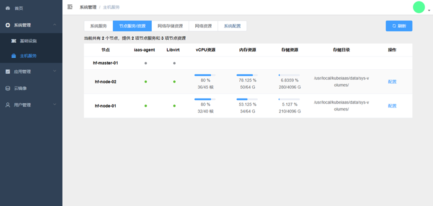
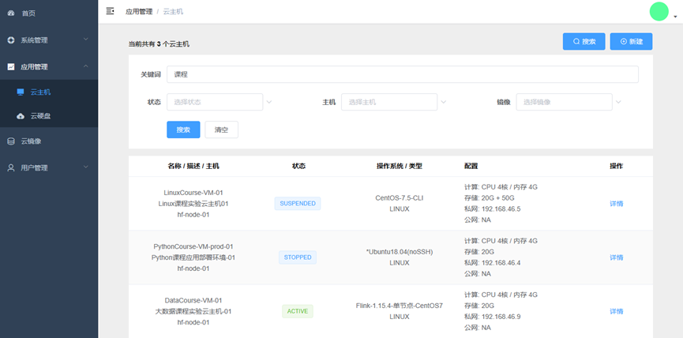

# KubeIaaS - Private IaaS Cloud Solution based on Kubernetes.

> [中文文档](./README-CN.md)

Developed by ["free4inno"](http://www.free4inno.com).

## ⭐ Introduction

KubeIaaS is a feature-rich and user-friendly private IaaS cloud solution based on Kubernetes. 
It is designed to leverage the powerful capabilities of Kubernetes and extend its application scope from the container cloud domain to the IaaS cloud domain, thereby enhancing the flexibility and scalability of IT infrastructure based on Kubernetes.

**Why Choose KubeIaaS ？**

- Compared to native Kubernetes, introducing KubeIaaS into Kubernetes enables it to provide both container cloud and IaaS cloud capabilities simultaneously, greatly improving the flexibility and scalability of supported IT infrastructure.

- Compared to other IaaS cloud platforms such as OpenStack and CloudStack, KubeIaaS utilizes Kubernetes to deploy and manage its various components, making deployment and operations more lightweight and convenient.

- Compared to other Kubernetes virtual machine resource extension components such as Kubevirt and Virtlet, KubeIaaS offers a more comprehensive set of IaaS cloud control capabilities, including cloud instances, cloud disks, and cloud images, along with a user-friendly web management interface.

[Watch introduction and demo.](https://www.bilibili.com/video/BV1em4y1C7uE/)

## 💡 Key Features

- **Easy Deployment**

KubeIaaS simplifies the complex deployment process by using YAML resource manifests to orchestrate containerized components within Kubernetes, eliminating the need for repetitive tasks. Detailed deployment guides are provided to adapt to different scenarios such as "bare-metal clusters" and "exist Kubernetes clusters".

- **Simplified Maintenance**

KubeIaaS leverages Kubernetes' resource scheduling capabilities and cloud-native operations suites such as Prometheus and Loki to significantly reduce system maintenance costs. Users can easily access the running status of system components, monitor the running status of host machines and virtual machines, and understand the usage status of system resources.

- **Comprehensive Functionality**

As a comprehensive private IaaS cloud solution, KubeIaaS offers an intuitive and user-friendly web management interface that enables users to easily create, configure, and manage various cloud resources such as virtual machines, cloud disks, and cloud images, significantly improving the efficiency and convenience of cloud infrastructure management.

- **Rich Resources**

Users can easily download and manage the images required for virtual machines in the cluster through KubeIaaS's official or self-built cloud image center.

## 🚀 Quick Start

- Deploy on Bare Metal [link](./deploy/deploy-os-ubuntu-22.04-cn.md)

- Deploy on Ubuntu without Kubernetes [link](./deploy/deploy-kubernetes-1.23-cn.md)

- Deploy on Ubuntu with Kubernetes [link](./deploy/deploy-kubeiaas-1.0-ubuntu-cn.md)

- Deploy on other OS [link](./deploy/deploy-kubeiaas-1.0-general-cn.md)

## 🎞️ Showcase

Below are screenshots of the system interface:

Home Page: Displays various data such as resource usage and cluster status metrics through dashboard cards.

System Management: Monitor system operation status and resource usage, and configure and manage the system.

Cloud VM List: Manage all cloud VM resources in the system, displaying information such as name, status, operating system, and configuration.

Cloud VM Details: Display various parameters of the cloud VM such as computing, network, storage, etc., and provide cloud VM control functions.

Cloud Disk List: Uniformly manage cloud disk resources in the system, display information such as name and description, mount information, storage capacity, etc.

Cloud Image List: Unified management of cloud image resources within the system, displaying information such as name, description, system type, and image parameters.

## 📦 Functions

The main functions provided by KubeIaaS to users are shown in the following table,

| **Type**         | **Function**         | **Details**                                                                                       |
|------------------|----------------------|---------------------------------------------------------------------------------------------------|
| Cloud VM         | Create               | Support Linux and Windows                                                                         |
|                  | Configuration        | Basic: name, description                                                                          |
|                  |                      | Compute: CPU, memory (support hot addition)                                                       |
|                  |                      | Storage: mount cloud disk (support hot plug and play)                                             |
|                  |                      | *Storage: system disk expansion and contraction                                                   |
|                  |                      | Network: automatic IP allocation (support dual NIC)                                               |
|                  |                      | *Network: IP binding                                                                              |
|                  | Control              | Support start and stop, suspend                                                                   |
|                  | Access               | Support Web VNC remote connection                                                                 |
|                  | *Migration           | *Offline migration                                                                                |
| Cloud Disk       | Create               | Custom capacity                                                                                   |
|                  | Configuration        | Mounted to the Cloud VM (support hot plug)                                                        |
|                  |                      | *Expansion and contraction                                                                        |
| Cloud Image      | Image release	       | One-click release of cloud VM as cloud image                                                      |
|                  | Image center         | Manual import: download the pre-installed image and upload it to the system for direct use        |
|                  |                      | *Automatic import: one-click import of pre-installed image through the image center               |
|                  | Custom image         | Support custom image based on KubeIaaS image specification                                        |
| System operation | Resource control     | System service component status monitoring                                                        |
|                  |                      | Automatic configuration and addition of host                                                      |
|                  |                      | *Metrics monitoring of host and cloud VM                                                          |
|                  | System configuration | Resource configuration (CPU and memory overcommitment, storage limit, network segment management) |
|                  |                      | System configuration (optional host specifications, Web VNC domain name, etc.)                    |
|                  | User management      | Users and user groups                                                                             |

(Functions marked with * indicate that they will be implemented in the upcoming new version.)

## 📖 Architecture

The design and implementation of KubeIaaS adhere to the following principles:

**Integrated scheduling capability, Integrated operations capability**

KubeIaaS fully utilizes the resource scheduling capabilities of Kubernetes and cloud-native operation and maintenance components such as Prometheus and Loki, realizing the integration of resource scheduling and platform operation and maintenance between container environments and IaaS cloud environments.

**Modularized control capabilities, Containerized component deployment**

KubeIaaS encapsulates IaaS cloud control capabilities into a series of cloud-native application components that can be deployed on top of Kubernetes, making it very convenient to deploy and maintain KubeIaaS using Kubernetes' application management capabilities.
