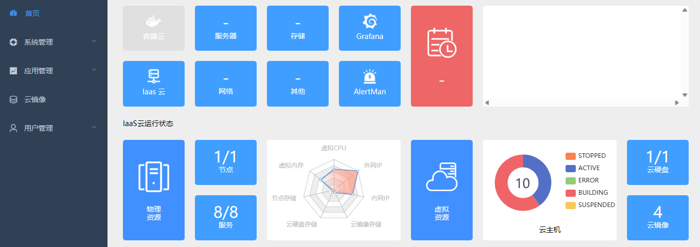
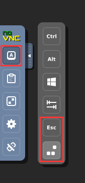
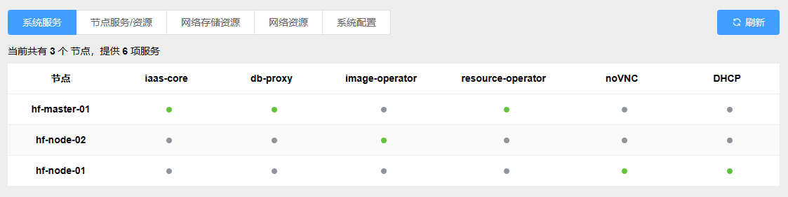

# 用户使用手册

本文档旨在介绍 KubeIaaS 的主要功能及其使用方法。

## 首次启动

访问 `<IP>:32200` 转到系统登录页面（此处所用 `<IP>` 为集群内任一节点IP）；

初始系统只拥有唯一的超级管理员用户： 用户名 `00000000000`，密码 `000000` ；

成功登录系统后，将跳转到系统首页

> 当前版本中，首页部分数据暂未接入

在正式创建云主机并进行系统使用之前，还需要关注以下几项配置：

1. [修改管理员密码](/docs/user-manual-cn.md#11-%E4%BF%AE%E6%94%B9%E5%AF%86%E7%A0%81)

2. [检查服务状态](/docs/user-manual-cn.md#1-%E7%B3%BB%E7%BB%9F%E6%9C%8D%E5%8A%A1)

3. [配置节点资源](/docs/user-manual-cn.md#2-%E8%8A%82%E7%82%B9%E6%9C%8D%E5%8A%A1%E8%B5%84%E6%BA%90)

4. [创建网络资源](/docs/user-manual-cn.md#4-%E7%BD%91%E7%BB%9C%E8%B5%84%E6%BA%90)

5. [导入或自定义云镜像](/docs/user-manual-cn.md#1-%E5%AF%BC%E5%85%A5%E4%BA%91%E9%95%9C%E5%83%8F)

确认完成以上相关配置后，即可 [创建云主机](/docs/user-manual-cn.md#1-%E6%96%B0%E5%BB%BA%E4%BA%91%E4%B8%BB%E6%9C%BA) 并开始使用其他IaaS云功能！

## 云主机

### 1. 新建云主机

在 “**应用管理-云主机-新建**“ 页面中，首先输入云主机名称与描述，

通过下拉列表选择已经上传到系统的云镜像
> 如果此处为空，请先 导入或自定义云镜像

通过下拉列表选择合适的计算资源（CPU、内存）规格
> 在 [系统配置](/docs/user-manual-cn.md#5-%E7%B3%BB%E7%BB%9F%E9%85%8D%E7%BD%AE) 中可自定义规格选项

通过下拉列表选择所需的系统盘存储大小

（如果您选择的系统盘空间小于镜像规定的最小空间需求，将会自动扩增到镜像最小需求空间）

> 在 [系统配置](/docs/user-manual-cn.md#5-%E7%B3%BB%E7%BB%9F%E9%85%8D%E7%BD%AE) 中可自定义规格选项

通过下拉列表选择云主机所在的宿主节点

（将会消耗该节点上的 CPU、内存资源 与 系统盘存储空间）

通过下拉列表选择网络规格与对应网段，可选的规格说明如下：

- 仅分配私网IP

将在云主机中仅创建一块网卡，并自动在所选网段内分配IP。

- 同时分配公网IP和私网IP

将在云主机中创建两块虚拟网卡，并自动在所选网段内为两块网卡分配不同IP。需要后期在主机内自行控制路由。

> 如果此处为空，请先 [创建网络资源](/docs/user-manual-cn.md#4-%E7%BD%91%E7%BB%9C%E8%B5%84%E6%BA%90) 并 选择主机节点

最后，请在末尾检查云主机的总体配置。确认完毕后，点击 创建 完成。

### 2. 远程访问

在 “**应用管理-云主机-详情**” 页面中，点击上方 “**远程**”。在弹出框中 “**复制**” VNC密码，而后点击 “**确定**”，

在新打开的VNC页面中点击 “**连接**”，将刚刚复制的密码粘贴，并点击 “**Send Credentials**”，

远程连接到您的云主机，并进行操作。

### 3. 计算资源调整

在 “**应用管理-云主机-详情**” 页面中，可以对计算资源（CPU、内存）进行调整。

调整过程中仅支持热增加（向上调整配置）。如果需要减少（向下调整配置），请先关闭云主机。

### 4. 发布镜像

在 “**应用管理-云主机-详情**” 页面中，点击 “**发布**” 即可将当前云主机发布为云镜像，包含云主机所有配置。使用新镜像创建的云主机与原云主机完全一致。

“**容量**” 指最小系统盘规格，如果待发布的云主机空间不足（例如，其上安装了大量应用），可以将容量设置为大于当前系统盘容量，确保基于该镜像创建的云主机有足够的可用空间。

## 云镜像

在 “**云镜像**” 页面中，可以对云主机所用的云镜像进行管理。

### 1. 导入云镜像

KubeIaaS 官方提供了一些预制镜像，通过链接下载镜像源文件和镜像描述文件（.yaml）,
将这些文件上传到 “**系统管理-主机服务-网络存储资源**” 中的显示配置的云镜像 NFS 存储目录，
即可在 “**云镜像**” 中看到此镜像，并可以在 “**应用管理-云主机-新建**” 中选择使用此镜像。

以下是 KubeIaaS 所提供的预制镜像，

| 镜像名称                               | 说明                                                                                                 | 下载地址                                                              |
|------------------------------------|----------------------------------------------------------------------------------------------------|-------------------------------------------------------------------|
| centos-7.5-cli                     | 采用 Ubuntu18.04 LTS Desktop 的云主机依赖的云镜像，包含图形化桌面并附加了SSH远程连接工具。                                        | 链接：https://pan.baidu.com/s/1Zqi2_mKAJ0UhOTW3oAqzCg   提取码：yt2j |
| ubuntu-18.04-lts-gui               | 采用 Ubuntu18.04 LTS Desktop 的云主机依赖的云镜像，包含图形化桌面并附加了SSH远程连接工具。                                        | 链接：https://pan.baidu.com/s/1ILvcUy896AOHU6OpUxVa9g   提取码：66w0 |
| kafka-2.12-standalone-on-centos7   | 基于云主机部署单节点的 Kafka 2.12。                                                                            | 链接：https://pan.baidu.com/s/1WskCpGhy-t4wJAKE2Y_HKQ   提取码：s55t |
| flink-1.15.4-standalone-on-centos7 | 基于云主机部署单节点的 Flink 1.15.4。Flink（官网）是一款开源流式数据处理框架。基于本模板部署的Flink配置了4个Slot，因此建议在创建云主机的时候CPU配置为4核。      | 链接：https://pan.baidu.com/s/12Lbh47HPBQsdNmrf_vN20Q   提取码：yyg3 |
| windows-server-2019-gui            | 采用 Windows Server 2019 的云主机依赖的云镜像（包含图形化桌面）。在云镜像挂载的 virtio.iso 中可以查找到系统所必须的驱动程序（网络驱动、PCI驱动、USB驱动等）。 | 链接：https://pan.baidu.com/s/1ofJvsonjuRExxZosYmVRHg   提取码：f00r |

### 2. 自定义云镜像

如果希望基于 iso 自制云主机镜像，请下载此镜像并进行修改：

该链接包含如下内容：

| 镜像名称                            | 包含文件                                                                                      | 下载地址                                                                |
|---------------------------------|-------------------------------------------------------------------------------------------|---------------------------------------------------------------------|
| custom-example   自定义云镜像示例模板 | `custom-example.yaml`   `ubuntu-22.04-desktop.qcow2`   `ubuntu-22.04-desktop.iso` | 链接: https://pan.baidu.com/s/1xCGnQUDnrMan1sYEKcQodA   提取码: ja7a |

替换其中的 iso 文件，并编辑 yaml，
完成后上传到 “**系统管理-主机服务-网络存储资源**” 中的显示配置的云镜像 NFS 存储目录。

具体操作说明如下：

1. 替换 iso 文件为带制作的系统 iso 引导镜像；
2. 替换 qcow2 与 yaml 文件名为待制作的系统名称；
3. 编辑 `custom.yaml`，
替换其中 `name`、`description`、`filename`、`child_images.uuid`、`child_images.name`；

4. 上传到 `iaas-config.yaml` 中的配置的云镜像 NFS 存储目录；
5. 基于该镜像在系统内创建云主机，由于目前系统盘为空，需要通过 iso 进行 boot；

> 使用 noVNC 提供的组合快捷键可以重启，并进入 BOOT MENU.
6. 选择从 ISO 启动后，正常安装系统即可；
7. 完成安装和配置后，可将云主机发布为镜像。

对于更进一步的需求，请参考 云镜像规范 自定义云镜像。按照相应规范组织系列文件并上传。

### 3. 从云主机发布

详见前文 [云主机-发布镜像](/docs/user-manual-cn.md#4-%E5%8F%91%E5%B8%83%E9%95%9C%E5%83%8F)。

## 云硬盘

### 1. 新建云硬盘

支持设置云硬盘名称、描述、容量。

> 在 [系统配置](/docs/user-manual-cn.md#5-%E7%B3%BB%E7%BB%9F%E9%85%8D%E7%BD%AE) 中可自定义云硬盘容量规格选项

### 2. 挂载与卸载

云硬盘支持 热挂载 与 热卸载。

> 请注意！热卸载有风险，可能会导致数据丢失或系统崩溃。

在 “**应用管理-云主机-详情**” 或 “**应用管理-云硬盘**” 页面中均可以进行操作。

在弹出的浮窗中，可以对 云主机 / 云硬盘 进行搜索。如果希望查看所有 云主机 / 云硬盘，则无需输入直接搜索即可。

## 用户管理

### 1. 用户

#### 1.1. 修改密码

在 “**用户管理-用户**” 页面中，支持对当前登录用户的密码进行修改。

如果管理员希望修改其他用户的密码请使用 重置密码。

#### 1.2. 重置密码

在 “**用户管理-用户**” 页面中，具有管理权限的用户可以重置其他用户的密码，重置后密码为 `000000`。

### 2. 用户组

在 “**用户管理-用户组**” 页面中，可创建不同的用户组可以区分用户间管理权限。

用户组的配置是一段 JSON 用于控制用户权限。目前仅包含一项配置，无需更改。

用户组组长可以对其他组内成员进行管理操作，而超级管理员则可以管理系统内所有成员。

## 系统管理

### 1. 系统服务

在 “**系统管理-主机服务-系统服务**” 页面中，展示了当前系统各个服务组件的运行状态，请确保该表格内不含有 红色 圆点，系统方可正常工作。

每个单元格内可能显示 灰色 / 绿色 / 红色 三种颜色：

- 灰色：该节点无需对应服务；

- 绿色：该节点需要对应服务，且工作正常；

- 红色：该节点需要对应服务，但工作异常！

### 2. 节点服务/资源

在 “**系统管理-主机服务-节点服务/资源**” 页面中，展示 工作节点 上所需的 计算服务状态 与 资源使用情况。

首次使用时请先对各个节点的资源限制进行配置。

### 3. 网络存储资源

在 “**系统管理-主机服务-网络存储资源**” 页面中，展示 云硬盘 与 云镜像 的 NFS 网络存储配置与空间

### 4. 网络资源

在 “**系统管理-主机服务-网络资源**” 页面中，为每个节点划分云主机网段，

以下是一些注意事项：

- 集群所在的网络环境不应当包含其他 DHCP Server，否则会与 KubeIaaS 的 DHCP 系统发生冲突；
- **“类型”** 分为两种。对于创建双网卡的云主机，将从两种网段中各选取一个分配IP。
- KubeIaaS 所支持的网络模式为桥接；
- **“网络接口”** 代表桥接的 Network Interface，与 `iaas-config.yaml` 中的配置有关，
  - MacVTap：填写对应节点上需要桥接到的物理网卡名称；
  - Linux Bridge：自行创建虚拟网桥，并填写网桥名称；
  - OVS Bridge：自行创建虚拟网桥，并填写网桥名称。
- **“网关”** 与 **“子网掩码”** 应当与宿主集群网络配置保持一致；
- DHCP 所在节点一定需要配置网段，否则 DHCP 将无法生效。

### 5. 系统配置

在 “**系统管理-主机服务-系统配置**” 页面中，可对系统选项进行配置。

各系统配置项及其内容说明如下表，

| 配置项           | 作用                | “内容”格式                                                         | “说明”格式             |
|---------------|-------------------|----------------------------------------------------------------|--------------------|
| DATA_VOLUME   | 控制云硬盘可选规格         | Integer   单位：Gb                   示例：20                | String   选项文字  |
| NETWORK_TYPE  | 控制网段类型的选项描述       | Enum    PUBLIC / PRIVATE          示例：PRIVATE           | String   选项文字  |
| SYS_VOLUME    | 控制云主机系统盘可选规格      | Integer   单位：Gb                  示例：20                 | String   选项文字  |
| VM_COMPUTE    | 控制云主机计算资源可选规格     | Integer,Integer   CPU核数,内存大小(Gb)   示例：2,2              | String   选项文字  |
| VM_STATUS     | 控制云主机搜索可选状态       | Enum    系统中包含的云主机状态               示例：ACTIVE            | String   选项文字  |
| VNC_DOMAIN    | 配置 Web noVNC 访问域名 | String   系统将使用该域名跳转               示例：example.novnc.com | String   无实际意义 |
| VOLUME_STATUS | 控制云硬盘搜索可选规格       | Enum    系统中包含的云硬盘状态              示例：ATTACHED           | String   选项文字  |